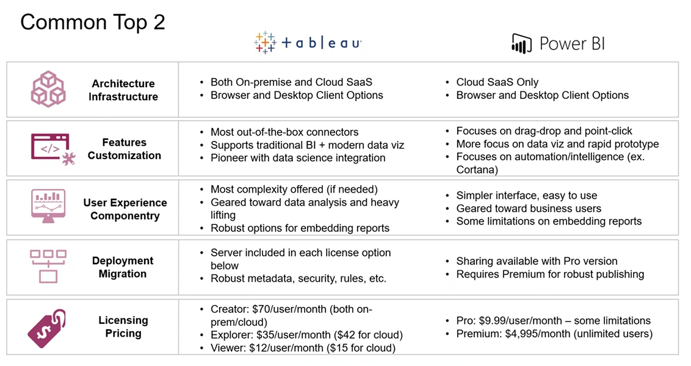
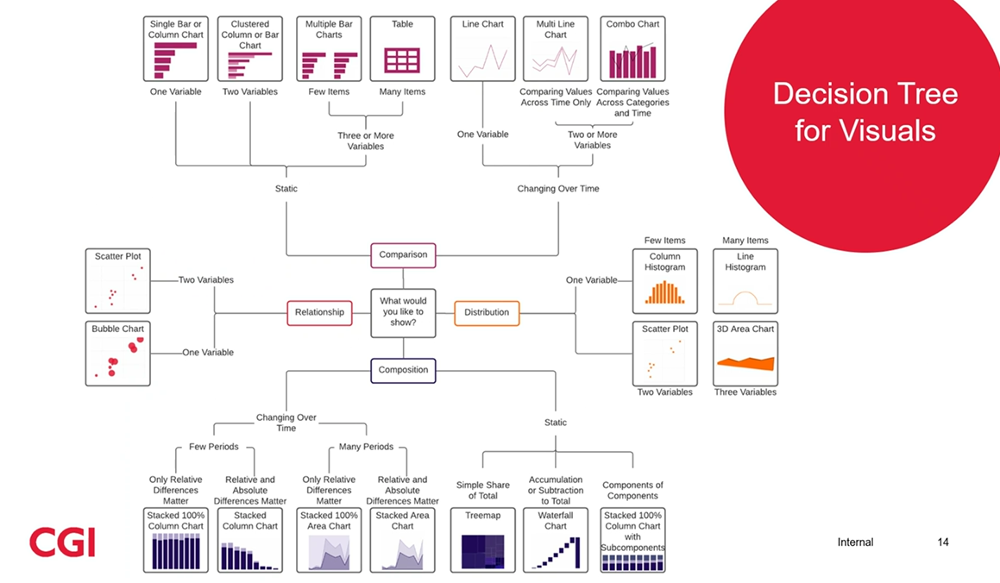

# Power BI 

> Carla Beghin

- Cincinatti, but Texas BU

> Cadey Moore

- Austin

- Day 1
  - Data Vis
  - Power BI Desktop
- Day 2
  - Report Builder

## Data Viz/B

- Develop insights
- Facilitate communication and information sharing
- Typical projects
  - Update reports from Excel/SSRS/We

## Desktop Artifacts

- Dataset - data from one or many sources
- Visual - Interactive, visual representation of data
- Tile - container for the visual on a dashboard
- Canvas - page on which the visual is organized
- Dashboard - single page or canvas containing a collection of visuals
- Reports - collection of visuals on one or more pages, more in-depth than a dashboard
- Workspace - location of powerbi

- Views
  - Model VIew
    - Connect to data
    - Build model
    - Manage queries
    - Prepare data
  - Data View
    - 
  - Report View

### DAX code

- Data Analysis Expressions
- Similar to Excel functions
- Most common:
  - aggregations
  - logical operators
  - text alterations
  - dates
  - `SUM, AVERAGE, IF, YEAR`

- Design
  - Easy Wins
    - Same font
    - Use color wisely and consistently
    - Branding guidance
  - Emphasis
    - Brighten, darken, enlarge, bold, underline
  - Minimize emphases
    - Lighten, thin, shrink, neutralize, increase transparency
  - Question
    - If I had never seen this before, where would the eye go first? Does that make sense?

## Power BI Services

- Cloud-based Saas used to create, share and host artifacts
- Assign permissions
- Minor tweaks or ad-hoc answers, not primary site for development

